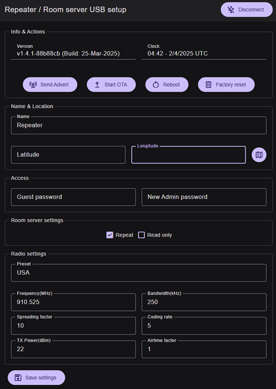

# Server Administration

  

> This section covers the configuration and management of repeaters and room servers in MeshCore.

  

## Repeater and Room Server Configuration

### How to configure a repeater or room server?

  

    
⚙️

    <h3>Initial Configuration Required</h3>
  

  
  
When MeshCore is first flashed onto a LoRa device, it is necessary to set the server device frequency so that it uses the legal frequency in your country or region.

  

## Administration Methods

  

    
🌐

    <h3>Web Configuration Interface</h3>
    
Access <strong>config.meshcore.dev</strong> to connect to the LoRa device via USB serial port and configure server name, frequency, location, passwords and other settings.

    

    <a href="https://config.meshcore.dev" target="_blank" class="github-link">
      Open Configuration Tool
    </a>
  

  
  

  
  

    
💻

    <h3>MeshCore Flasher Console</h3>
    
Connect the server device using a USB cable to a computer running Chrome. Access <strong>flasher.meshcore.co.uk</strong> and use the console function to connect to the device.

    

      <code>set freq {frequency}</code>
    

     

    <a href="https://flasher.meshcore.co.uk/" target="_blank" class="github-link">
      https://flasher.meshcore.co.uk/
    </a>
  

  

  
  

    
📱

    <h3>Remote Administration via Smartphone</h3>
    
Use a MeshCore smartphone client to administer servers remotely via LoRa communication.

  

  
  

    
🔓

    <h3>Administration via Unlocked T-Deck</h3>
    
A T-Deck running unlocked/registered MeshCore firmware allows remote server administration. Registration supports MeshCore development.

      

    <a href="https://buymeacoffee.com/ripplebiz/e/249834" target="_blank" class="github-link">
      Register T-Deck
    </a>
  

    
  

  

## Configuration Interface

  

    <h3>Repeater / Room Server USB Setup</h3>
    
The web interfaces allow you to configure all essential parameters through intuitive graphical interfaces. The configuration tool provides real-time access to device settings and radio parameters.

  

  
  

    
 
  

  

## Configuration Parameters

  

    <h3>Device Settings</h3>
    <ul>
      <li>Device name</li>
      <li>Latitude and longitude</li>
      <li>Guest password</li>
      <li>New administrator password</li>
    </ul>
  

  
  

    <h3>Radio Settings</h3>
    <ul>
      <li>Regional preset (e.g., USA)</li>
      <li>Frequency (MHz): e.g., 910.525</li>
      <li>Bandwidth (kHz): e.g., 250</li>
      <li>Spreading factor: e.g., 10</li>
      <li>TX Power (dBm): e.g., 22</li>
      <li>Coding rate: e.g., 5</li>
      <li>Airtime factor: e.g., 1</li>
    </ul>
  

  

## Room Server Specific Configuration

  

    <h3>Room Server Settings</h3>
  

  
  

    

      
MESSAGE RETRIEVAL

      
When a client connects to a room server, they will receive the last 16 unseen messages.

    

    

      
COMBINED ROLE

      
A room server can also take on the repeater role. Use the command: set repeat {on|off}

    

    

      <h4>Available Parameters:</h4>
      <ul>
        <li><strong>Repeat:</strong> Enable repeater role</li>
        <li><strong>Read only:</strong> Read-only mode</li>
      </ul>
    

  

  

## Advanced Administration

  

    <h3>Remote Firmware Updates</h3>
    
For RAK4631 repeaters, remote firmware updates are possible. This feature allows maintaining devices up to date without physical access.

  

  
  

    <h3>Location Management</h3>
    
Setting location for repeaters is not mandatory, but it can be useful for mapping and network organization.

  

  
  

    <h3>Bluetooth Access</h3>
    
Repeaters can be accessed via BLE (Bluetooth Low Energy) for configuration and remote administration from compatible clients. Default pairing code: 123456

  

  

## CLI Reference

  

    
⌨️

    <h3>Command Line Reference</h3>
  

  
  
For a complete CLI command reference for repeaters and room servers, visit:

  <a href="https://github.com/ripplebiz/MeshCore/wiki/Repeater-&-Room-Server-CLI-Reference" class="cli-link">
    📚
    Repeater & Room Server CLI Reference
  </a>

