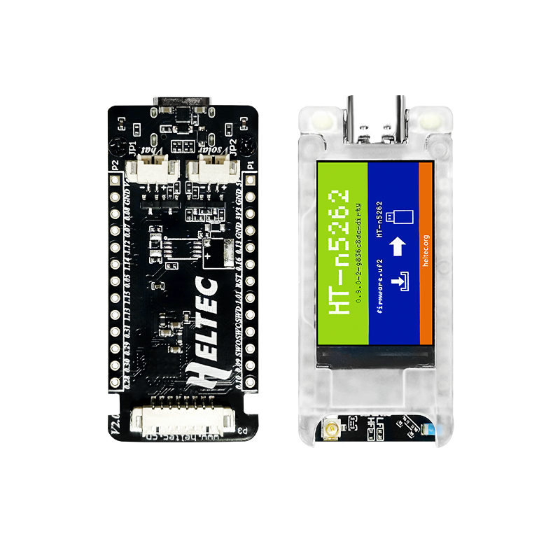

# Heltec T114

  

  

    
  

  

    
Compact nRF52840-based LoRa node with low power consumption, LCD display, and versatile power options.

    

      

        ✓
        Companion Radio Firmware
      

      

        ✓
        Repeater
      

      

        ✓
        Room Server
      

    

  

  

    
Processor

    
nRF52840

  

  

    
LoRa Chip

    
SX1262

  

  

    
Display

    
1.14 inch TFT-LCD screen (135×240 pixels)

  

  

    
Deep Sleep

    
11 μA consumption

  

  

    
Low Power Mode

    
23 μA

  

  

    
GPS

    
Integrated GPS module (optional)

  

  

    
Operating Temperature

    
-20 ~ 70°C

  

  

    
USB Interface

    
Type-C with protection features

  

  

    <h3 class="features-title">Key Features</h3>
    

      

        Display
      

      

        Bluetooth 5.0
      

      

        WiFi
      

      

        GPS (optional)
      

      

        Deep Sleep
      

      

        Protective Case
      

    

  

  
  

    <h3 class="notes-title">Power Options</h3>
    

      

        

          <svg xmlns="http://www.w3.org/2000/svg" width="24" height="24" viewBox="0 0 24 24" fill="none" stroke="currentColor" stroke-width="2" stroke-linecap="round" stroke-linejoin="round"><path d="M7 19h10"></path><path d="M7 5h10"></path><path d="M11 19v-5a2 2 0 0 0-2-2H4"></path><path d="M13 5v5a2 2 0 0 0 2 2h5"></path></svg>
        

        
USB Type-C

      

      

        

          <svg xmlns="http://www.w3.org/2000/svg" width="24" height="24" viewBox="0 0 24 24" fill="none" stroke="currentColor" stroke-width="2" stroke-linecap="round" stroke-linejoin="round"><rect x="6" y="7" width="12" height="10" rx="2" ry="2"></rect><line x1="10" y1="7" x2="10" y2="4"></line><line x1="14" y1="7" x2="14" y2="4"></line></svg>
        

        
LiPo Battery (1.252P connector)

      

      

        

          <svg xmlns="http://www.w3.org/2000/svg" width="24" height="24" viewBox="0 0 24 24" fill="none" stroke="currentColor" stroke-width="2" stroke-linecap="round" stroke-linejoin="round"><circle cx="12" cy="12" r="5"></circle><line x1="12" y1="1" x2="12" y2="3"></line><line x1="12" y1="21" x2="12" y2="23"></line><line x1="4.22" y1="4.22" x2="5.64" y2="5.64"></line><line x1="18.36" y1="18.36" x2="19.78" y2="19.78"></line><line x1="1" y1="12" x2="3" y2="12"></line><line x1="21" y1="12" x2="23" y2="12"></line><line x1="4.22" y1="19.78" x2="5.64" y2="18.36"></line><line x1="18.36" y1="5.64" x2="19.78" y2="4.22"></line></svg>
        

        
Solar Panel (1.252P connector)

      

    

    

      <h4>Additional Interfaces</h4>
      <ul class="notes-list">
        <li>GNSS module connector (1.25×8P)</li>
        <li>USB Type-C with voltage regulator, ESD and short-circuit protection</li>
      </ul>
    

  

  

## Detailed Specifications

  <table>
    <thead>
      <tr>
        <th>Parameter</th>
        <th>Description</th>
      </tr>
    </thead>
    <tbody>
      <tr>
        <td>Processor</td>
        <td>nRF52840</td>
      </tr>
      <tr>
        <td>LoRa Chip</td>
        <td>SX1262</td>
      </tr>
      <tr>
        <td>Display</td>
        <td>1.14 inch TFT-LCD screen, 135(H)RGB x 240(V) pixels</td>
      </tr>
      <tr>
        <td>Deep Sleep Consumption</td>
        <td>11 μA</td>
      </tr>
      <tr>
        <td>GPS</td>
        <td>Integrated GPS module (optional)</td>
      </tr>
      <tr>
        <td>Power Interfaces</td>
        <td>Multiple (USB Type-C, lithium battery, solar panel)</td>
      </tr>
      <tr>
        <td>Operating Temperature</td>
        <td>-20 ~ 70°C</td>
      </tr>
      <tr>
        <td>USB Interface</td>
        <td>Type-C with voltage regulator, ESD protection, short-circuit protection</td>
      </tr>
      <tr>
        <td>Connectors</td>
        <td>LiPo battery connector 1.252P, solar panel connector 1.252P, GNSS module connector 1.25*8P</td>
      </tr>
    </tbody>
  </table>

  

## Power Efficiency

  

    

      
Deep Sleep

      

        
11 μA

      

    

  

  

    The Heltec T114 offers exceptional power efficiency with ultra-low power consumption in sleep modes, making it ideal for long-term deployments and battery-powered applications.
  

