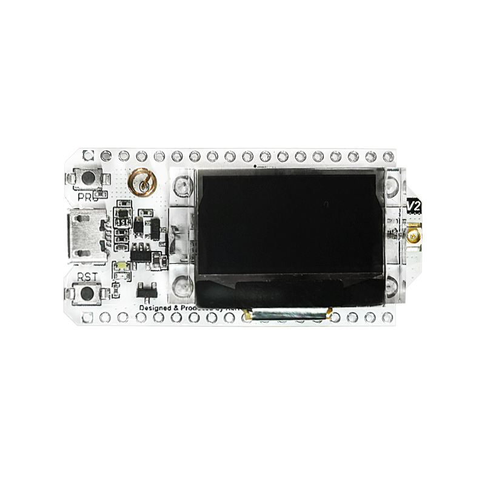

# Heltec WiFi LoRa 32 (V2)

  

  

    
  

  

    
Classic ESP32-based LoRa + Wi-Fi + OLED board with battery management.

    

      

        ✓
        Companion Radio Firmware
      

      

        ✓
        Repeater
      

      

        ?
        Room Server (To be confirmed)
      

    

  

  

    
Main Chip

    
ESP32 (dual-core 32-bit MCU + ULP core)

  

  

    
LoRa Chip

    
SX1276/SX1278

  

  

    
CPU Frequency

    
240 MHz

  

  

    
Flash Memory

    
8MB

  

  

    
LoRa Bands

    
EU_433, CN_470_510, EU_863_870, US_902_928

  

  

    
USB Interface

    
Type-C with various protections

  

  

    
Display

    
0.96 inch OLED screen (128×64)

  

  

    
Standby Current

    
≤ 800uA

  

  

    <h3 class="features-title">Key Features</h3>
    

      

        Display
      

      

        WiFi
      

      

        Bluetooth
      

      

        Built-in Antenna
      

      

        USB to Serial
      

      

        Deep Sleep
      

      

        Battery Charging
      

    

  

  
  

    <h3 class="notes-title">Implementation Details</h3>
    <ul class="notes-list">
      <li>Dedicated 2.4 GHz metal spring antenna for WiFi and Bluetooth</li>
      <li>Integrated CP2102 chip for programming and debugging</li>
      <li>SH1.25-2 battery interface with integrated lithium battery management system</li>
      <li>Battery management includes charging/discharging control, overcharge protection, and power detection</li>
    </ul>
  

  

## Detailed Specifications

  <table>
    <thead>
      <tr>
        <th>Parameter</th>
        <th>Description</th>
      </tr>
    </thead>
    <tbody>
      <tr>
        <td>Main Chip</td>
        <td>ESP32 (dual-core 32-bit MCU + ULP core)</td>
      </tr>
      <tr>
        <td>LoRa Chip</td>
        <td>SX1276/SX1278</td>
      </tr>
      <tr>
        <td>Max CPU Frequency</td>
        <td>240 MHz</td>
      </tr>
      <tr>
        <td>Flash Memory</td>
        <td>8MB</td>
      </tr>
      <tr>
        <td>Supported LoRa Bands</td>
        <td>EU_433, CN_470_510, EU_863_870, US_902_928</td>
      </tr>
      <tr>
        <td>USB Interface</td>
        <td>Type-C with voltage regulator, ESD protection, short-circuit protection, RF protection</td>
      </tr>
      <tr>
        <td>Battery</td>
        <td>SH1.25-2 battery interface, integrated lithium battery management system (charging and discharging, overcharge protection, power detection, automatic USB/battery switching)</td>
      </tr>
      <tr>
        <td>Display</td>
        <td>0.96 inch OLED screen 128*64 dots</td>
      </tr>
      <tr>
        <td>Standby Current</td>
        <td>≤ 800uA</td>
      </tr>
    </tbody>
  </table>

  

