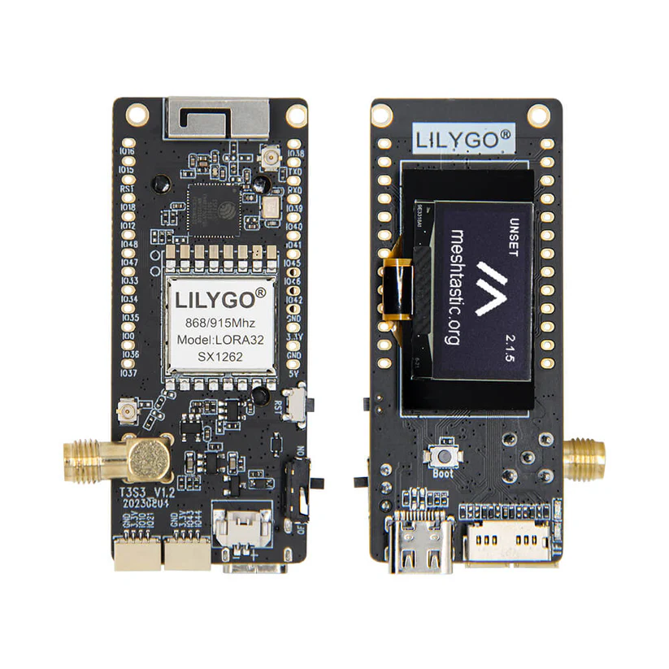

# LilyGo T3S3

  

  

    
  

  

    
Compact ESP32-S3 based LoRa development board with built-in OLED display and multiple LoRa chip options.

    

      
868/915MHz (SX1262/SX1276)

      
2.4GHz (SX1280)

    

    

      

        ✓
        Companion Radio Firmware
      

      

        ✓
        Repeater
      

      

        ✓
        Room Server
      

    

  

  

    
Processor

    
ESP32-S3

  

  

    
LoRa Chip Options

    
SX1262 (868/915MHz), SX1276 (868/915MHz), SX1280 (2.4GHz)

  

  

    
Display

    
0.96 inch OLED

  

  

    
Antenna Connector

    
IPEX/U.FL or SMA (depending on version)

  

  

    
Memory Card

    
TF card (microSD) support

  

  

    
Output Power

    
20 dBm (SX1280 version with PA)

  

  

    
Power Supply

    
USB and 3.7V LiPo battery

  

  

    
Connectivity

    
WiFi, BLE 5.0

  

  

    <h3 class="features-title">Key Features</h3>
    

      

        Display
      

      

        Bluetooth
      

      

        WiFi
      

      

        External Antenna
      

      

        microSD Support
      

      

        Battery Support
      

    

  

  
  

    <h3 class="notes-title">Available LoRa Variants</h3>
    

      

        
868/915MHz Version

        <ul class="variant-features">
          <li>Available with SX1262 or SX1276 LoRa chips</li>
          <li>Compatible with standard MeshCore frequency bands</li>
          <li>Ideal for long-range communication</li>
          <li>Regional regulations apply to frequency use</li>
        </ul>
      

      

        
2.4GHz Version

        <ul class="variant-features">
          <li>Equipped with SX1280 LoRa chip</li>
          <li>Higher frequency allows for global use</li>
          <li>Power amplifier (PA) provides 20 dBm output</li>
          <li>Shorter range but higher data rates</li>
        </ul>
      

    

  

  

## Detailed Specifications

  <table>
    <thead>
      <tr>
        <th>Parameter</th>
        <th>Description</th>
      </tr>
    </thead>
    <tbody>
      <tr>
        <td>Processor</td>
        <td>ESP32-S3</td>
      </tr>
      <tr>
        <td>LoRa Chip</td>
        <td>Multiple options available: SX1262 (868/915MHz), SX1276 (868/915MHz), SX1280 (2.4GHz)</td>
      </tr>
      <tr>
        <td>Display</td>
        <td>0.96 inch OLED</td>
      </tr>
      <tr>
        <td>Antenna Connector</td>
        <td>IPEX/U.FL or SMA (depending on version)</td>
      </tr>
      <tr>
        <td>Memory Card Support</td>
        <td>Yes, TF card (microSD)</td>
      </tr>
      <tr>
        <td>Output Power</td>
        <td>For the SX1280 version with PA, output power of 20 dBm</td>
      </tr>
      <tr>
        <td>Power Supply</td>
        <td>USB and 3.7V LiPo battery</td>
      </tr>
      <tr>
        <td>Bluetooth</td>
        <td>Yes, BLE 5.0 (inferred from ESP32-S3)</td>
      </tr>
      <tr>
        <td>WiFi</td>
        <td>Yes (inferred from ESP32-S3)</td>
      </tr>
    </tbody>
  </table>

  

