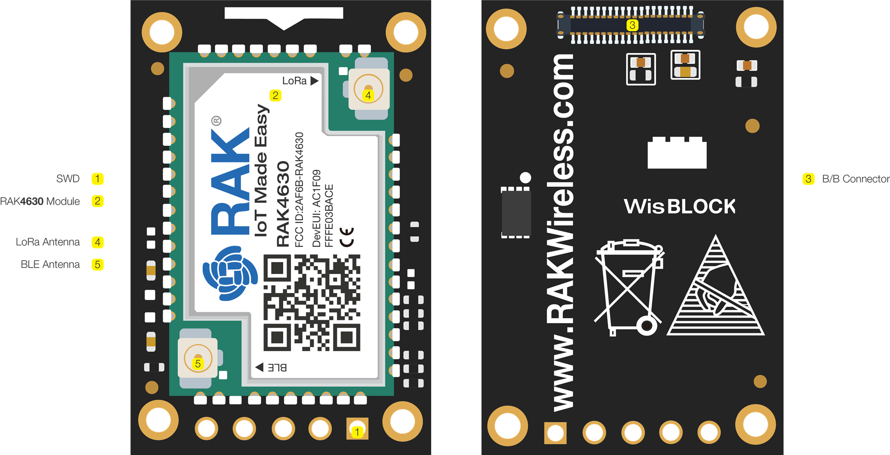

# RAK4631

  

  

    
  

  

    
WisBlock Core module with Nordic nRF52840 MCU and SX1262 LoRa chip for MeshCore applications.

    

      

        ✓
        Companion Radio Firmware
      

      

        ✓
        Repeater
      

      

        ?
        Room Server (To be confirmed)
      

    

  

  

    
Main Chip

    
Nordic nRF52840 MCU

  

  

    
LoRa Chip

    
SX1262

  

  

    
Maximum TX Power

    
Up to 22 dBm

  

  

    
Link Budget

    
Up to 170dB

  

  

    
Sleep Consumption

    
2.0 μA

  

  

    
Bluetooth

    
BLE 5.0 with power up to 4 dBm

  

  

    
Antenna Connector

    
IPEX (U.FL)

  

  

    
Interfaces

    
WisConnector for WisBlock base boards

  

  

    <h3 class="features-title">Key Features</h3>
    

      

        Display
      

      

        Bluetooth
      

      

        WiFi
      

      

        Deep Sleep
      

      

        GPS
      

      

        Battery Charging
      

      

        Low Power Modes
      

    

  

  
  

    <h3 class="notes-title">Notes</h3>
    <ul class="notes-list">
      <li>Display can be used with external displays via WisBlock modules</li>
      <li>GPS not integrated, but can be added via extension modules</li>
    </ul>
  

  

## Detailed Specifications

  <table>
    <thead>
      <tr>
        <th>Parameter</th>
        <th>Description</th>
      </tr>
    </thead>
    <tbody>
      <tr>
        <td>Main Chip</td>
        <td>Nordic nRF52840 MCU</td>
      </tr>
      <tr>
        <td>LoRa Chip</td>
        <td>SX1262</td>
      </tr>
      <tr>
        <td>Maximum TX Power</td>
        <td>Up to 22 dBm</td>
      </tr>
      <tr>
        <td>Link Budget</td>
        <td>Up to 170dB</td>
      </tr>
      <tr>
        <td>Sleep Consumption</td>
        <td>2.0 μA</td>
      </tr>
      <tr>
        <td>Bluetooth</td>
        <td>BLE 5.0 with power up to 4 dBm</td>
      </tr>
      <tr>
        <td>Frequency Range</td>
        <td>RAK4631(H): 779-923MHz, RAK4631(L): 433-470MHz</td>
      </tr>
      <tr>
        <td>Antenna Connector</td>
        <td>IPEX (U.FL)</td>
      </tr>
      <tr>
        <td>Interfaces</td>
        <td>WisConnector for connection to WisBlock base boards</td>
      </tr>
      <tr>
        <td>Supported Protocol</td>
        <td>LoRaWAN 1.0.2 and point-to-point LoRa communication</td>
      </tr>
    </tbody>
  </table>

  

## Compatible Modes

  <table>
    <thead>
      <tr>
        <th>Mode</th>
        <th>Support</th>
      </tr>
    </thead>
    <tbody>
      <tr>
        <td>Companion Radio Firmware</td>
        <td class="mode-supported">Yes</td>
      </tr>
      <tr>
        <td>Repeater</td>
        <td class="mode-supported">Yes</td>
      </tr>
      <tr>
        <td>Room Server</td>
        <td class="mode-pending">To be confirmed</td>
      </tr>
    </tbody>
  </table>

  

