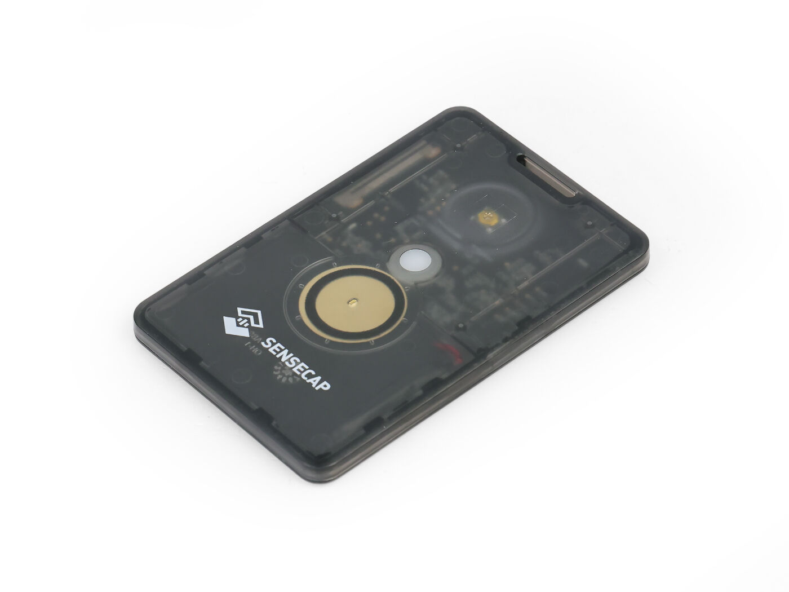

# SenseCAP T1000-E

  

  

    
  

  

    
IP65-rated credit card sized tracker with LoRa, Bluetooth, GPS and integrated sensors.

    

      
IP65 Water Resistant

      
Credit Card Size

    

    

      

        ✓
        Companion Radio Firmware
      

      

        ✓
        Repeater
      

      

        ✓
        Room Server
      

    

  

  

    
Dimensions

    
Credit card size, 6.5 mm thickness

  

  

    
Processor

    
Nordic nRF52840

  

  

    
LoRa Chip

    
Semtech LR1110

  

  

    
GPS

    
MediaTek AG3335 module

  

  

    
LoRa Frequency

    
863-928 MHz

  

  

    
Battery

    
700mAh Lithium

  

  

    
Protection

    
IP65 (water and dust resistant)

  

  

    
Interface

    
One button and a buzzer

  

  

    <h3 class="features-title">Key Features</h3>
    

      

        Display
      

      

        Bluetooth
      

      

        WiFi
      

      

        GPS
      

      

        Water Resistance
      

      

        Temperature Sensor
      

      

        Light Sensor
      

      

        Accelerometer
      

      

        Multi-Protocol
      

    

  

  
  

    <h3 class="notes-title">Battery Information</h3>
    

      

        
Without GPS

        
Up to 3 days

        
GPS and telemetry disabled

      

      

        
With GPS

        
About 2 days

        
With GPS enabled

      

    

    

      <h4>Charging Interface</h4>
      
4 pogo pins for charging and API interface

    

  

  

## Detailed Specifications

  <table>
    <thead>
      <tr>
        <th>Parameter</th>
        <th>Description</th>
      </tr>
    </thead>
    <tbody>
      <tr>
        <td>Format</td>
        <td>Credit card size, 6.5 mm thickness</td>
      </tr>
      <tr>
        <td>Processor</td>
        <td>Nordic nRF52840</td>
      </tr>
      <tr>
        <td>LoRa Chip</td>
        <td>Semtech LR1110</td>
      </tr>
      <tr>
        <td>GPS</td>
        <td>MediaTek AG3335 module</td>
      </tr>
      <tr>
        <td>LoRa Frequency Range</td>
        <td>863-928 MHz</td>
      </tr>
      <tr>
        <td>Battery</td>
        <td>700mAh Lithium</td>
      </tr>
      <tr>
        <td>Protection</td>
        <td>IP65 (water and dust resistant)</td>
      </tr>
      <tr>
        <td>Integrated Sensors</td>
        <td>Temperature, brightness, 3-axis accelerometer</td>
      </tr>
      <tr>
        <td>Charging Interface</td>
        <td>4 pogo pins for charging and API interface</td>
      </tr>
      <tr>
        <td>User Interface</td>
        <td>One button and a buzzer</td>
      </tr>
      <tr>
        <td>Battery Life</td>
        <td>Up to 3 days without GPS or telemetry, about 2 days with GPS enabled</td>
      </tr>
      <tr>
        <td>Protocol Compatibility</td>
        <td>LoRa, Bluetooth, Thread and ZigBee</td>
      </tr>
      <tr>
        <td>Bluetooth</td>
        <td>Bluetooth 5.0</td>
      </tr>
    </tbody>
  </table>

  

## Key Applications

  

    
Compact Tracking

    

      Credit card sized form factor makes it ideal for personal tracking applications where size matters.
    

  

  
  

    
Outdoor Use

    

      IP65 water and dust resistance enables deployment in challenging outdoor environments.
    

  

  
  

    
Mobile Deployment

    

      Multi-day battery life enables extended operation in field conditions without frequent recharging.
    

  

  
  

    
Environmental Monitoring

    

      Built-in sensors for temperature, brightness and movement enable environmental data collection.
    

  

