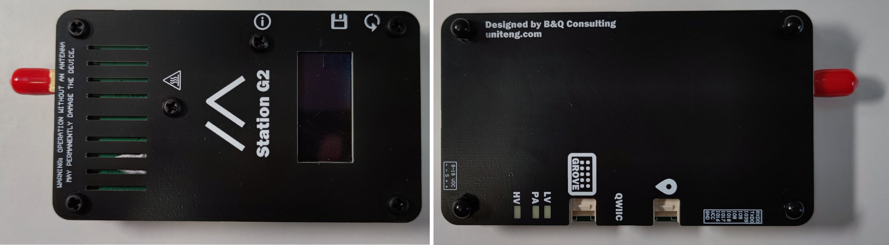

# Station G2

  

  

    
  

  

    
High-power LoRa gateway with 5W transmit capability, excellent sensitivity, and robust construction for fixed or vehicle installations.

    

      

        ⚡
        High Power (5W)
      

      

        📡
        Extended Range
      

      

        🏗️
        Industrial Grade
      

    

    

      

        ✓
        Companion Radio Firmware
      

      

        ✓
        Repeater
      

      

        ✓
        Room Server
      

    

  

  

    
Processor

    
ESP32-S3

  

  

    
LoRa Chip

    
SX1262

  

  

    
Max RF Output Power

    
US915: 36.5 dBm (4.46 W) EU868: 37 dBm (5 W)

  

  

    
LoRa Amplifier

    
P1dB of 35 dBm (3.16 W)

  

  

    
Antenna Connector

    
Robust SMA

  

  

    
Power Supply

    
USB Type-C (15V PD) or external 9-19VDC

  

  

    
Frequency Bands

    
US (902-928MHz), EU_868 (869.4-869.65MHz), and others

  

  

    
Construction

    
Stacked PCBs with aluminum substrate as heat sink

  

  

    <h3 class="features-title">Key Features</h3>
    

      

        Display
      

      

        Bluetooth
      

      

        WiFi
      

      

        Rich External I/Os
      

      

        High TX Power
      

      

        Enhanced Sensitivity
      

      

        Robust Design
      

    

  

  
  

    <h3 class="notes-title">Application Notes</h3>
    <ul class="notes-list">
      <li>Ideal for fixed station or vehicle mounted applications</li>
      <li>LoRa sensitivity is 4 dB higher than most other devices thanks to an ultra-low noise figure LNA</li>
      <li>Main application as a base station for extended mesh networks</li>
      <li>Solid construction designed for permanent installations</li>
    </ul>
  

  

## Performance Advantages

  

    
📡

    
Extended Range

    

      
With its high-power 5W transmitter and enhanced receiver sensitivity, the Station G2 can achieve significantly longer range than standard LoRa devices.

      
The ultra-low noise figure LNA provides 4 dB better sensitivity than typical LoRa devices, improving weak signal reception.

    

  

  
  

    
🔌

    
Flexible Power Options

    

      
The Station G2 can be powered via USB Type-C with 15V Power Delivery support or through an external power supply accepting 9-19V DC.

      
This flexibility makes it suitable for permanent installations with backup power systems or mobile applications such as vehicle mounting.

    

  

  
  

    
🌐

    
Network Extension

    

      
As a high-power, high-sensitivity device, the Station G2 excels as a network extender when configured as a repeater or room server.

      
Its robust design and excellent RF performance make it the ideal backbone component for large-scale MeshCore deployments.

    

  

  

## Detailed Specifications

  <table>
    <thead>
      <tr>
        <th>Parameter</th>
        <th>Description</th>
      </tr>
    </thead>
    <tbody>
      <tr>
        <td>Processor</td>
        <td>ESP32-S3</td>
      </tr>
      <tr>
        <td>LoRa Chip</td>
        <td>SX1262</td>
      </tr>
      <tr>
        <td>LoRa Amplifier</td>
        <td>1 dB compression point (P1dB) of 35 dBm (3.16 W)</td>
      </tr>
      <tr>
        <td>Max RF Output Power</td>
        <td>36.5 dBm (4.46 W) for US915 and 37 dBm (5 W) for EU868</td>
      </tr>
      <tr>
        <td>LoRa Sensitivity</td>
        <td>4 dB higher than most other devices thanks to an ultra-low noise figure LNA</td>
      </tr>
      <tr>
        <td>Antenna Connector</td>
        <td>Robust SMA</td>
      </tr>
      <tr>
        <td>Power Supply</td>
        <td>USB Type-C (15V PD) or external power supply 9-19VDC</td>
      </tr>
      <tr>
        <td>Supported Frequency Bands</td>
        <td>US (902-928MHz), EU_868 (869.4-869.65MHz), and several other global regions</td>
      </tr>
      <tr>
        <td>Construction</td>
        <td>Stacked PCBs with aluminum substrate PCB as heat sink</td>
      </tr>
    </tbody>
  </table>

