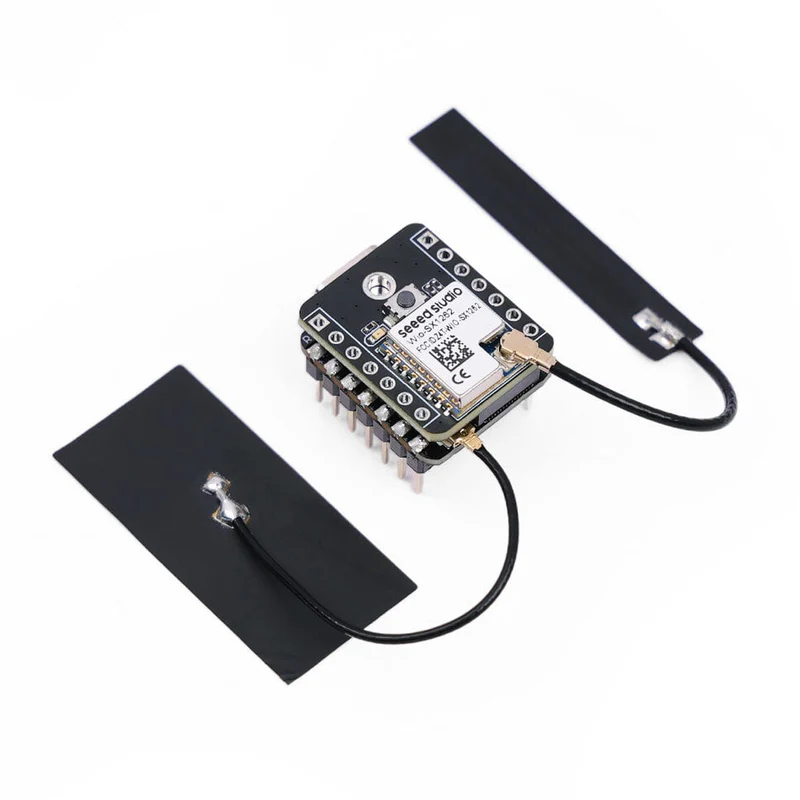

# Xiao S3 WIO

  

  

    
  

  

    
Compact ESP32-S3 based development board with integrated Wio-SX1262 LoRa module for long-range wireless communication.

    

      

        ✓
        Companion Radio Firmware
      

      

        ✓
        Repeater
      

      

        ?
        Room Server (To be confirmed)
      

    

  

  

    
Processor

    
ESP32-S3 dual-core Xtensa LX7 up to 240 MHz

  

  

    
Memory

    
8MB Flash and 8MB PSRAM

  

  

    
LoRa Module

    
Wio-SX1262

  

  

    
LoRa Frequency

    
862-930 MHz

  

  

    
Connectivity

    
WiFi 2.4 GHz, BLE 5.0

  

  

    
Dimensions

    
21 × 18 mm (compact format)

  

  

    
Power Interface

    
USB Type-C

  

  

    
Antenna Connector

    
IPEX/U.FL

  

  

    <h3 class="features-title">Key Features</h3>
    

      

        Display
      

      

        Bluetooth
      

      

        WiFi
      

      

        LoRa
      

      

        USB-C
      

      

        Extensibility
      

      

        Arduino Compatible
      

      

        MicroPython
      

      

        Optional Case
      

    

  

  
  

    <h3 class="notes-title">Implementation Notes</h3>
    <ul class="notes-list">
      <li>Extremely compact form factor (21 × 18 mm) ideal for space-constrained projects</li>
      <li>Display not integrated but can be added via expansion cards</li>
      <li>Impressive LoRa range of 2-5 km with external antenna</li>
      <li>WiFi and BLE range of 100+ meters</li>
    </ul>
  

  

## Detailed Specifications

  <table>
    <thead>
      <tr>
        <th>Parameter</th>
        <th>Description</th>
      </tr>
    </thead>
    <tbody>
      <tr>
        <td>Processor</td>
        <td>ESP32-S3 with dual-core Xtensa 32-bit LX7 processor up to 240 MHz</td>
      </tr>
      <tr>
        <td>Memory</td>
        <td>8MB Flash and 8MB PSRAM</td>
      </tr>
      <tr>
        <td>LoRa Module</td>
        <td>Wio-SX1262</td>
      </tr>
      <tr>
        <td>LoRa Frequency Range</td>
        <td>862-930 MHz</td>
      </tr>
      <tr>
        <td>WiFi</td>
        <td>2.4 GHz</td>
      </tr>
      <tr>
        <td>Bluetooth</td>
        <td>BLE 5.0</td>
      </tr>
      <tr>
        <td>LoRa Range</td>
        <td>2-5 km with external antenna</td>
      </tr>
      <tr>
        <td>WiFi/BLE Range</td>
        <td>100m+</td>
      </tr>
      <tr>
        <td>Dimensions</td>
        <td>21 x 18 mm (compact format)</td>
      </tr>
      <tr>
        <td>Power Interface</td>
        <td>USB Type-C</td>
      </tr>
      <tr>
        <td>Power Management</td>
        <td>Integrated power management chip</td>
      </tr>
      <tr>
        <td>LoRa Antenna Connector</td>
        <td>IPEX/U.FL</td>
      </tr>
      <tr>
        <td>Extensibility</td>
        <td>Via I2C, UART and GPIO interfaces</td>
      </tr>
      <tr>
        <td>Development Compatibility</td>
        <td>Arduino and MicroPython</td>
      </tr>
    </tbody>
  </table>

  

## Integration Options

  

    
Expansion Capabilities

    

      
The Xiao S3 WIO offers numerous integration possibilities through its expansion interfaces:

      <ul class="option-list">
        <li>Add displays via I2C interface</li>
        <li>Connect sensors through GPIO pins</li>
        <li>Interface with other devices using UART</li>
        <li>Enhance functionality with expansion cards</li>
      </ul>
    

  

  
  

    
Enclosure Options

    

      
Available in different package configurations:

      <ul class="option-list">
        <li>Basic board only for integration into custom projects</li>
        <li>Version with 3D printed enclosure for ready-to-deploy solutions</li>
        <li>Compatible with various third-party cases and enclosures</li>
      </ul>
    

  

